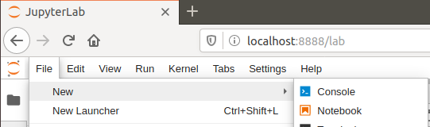
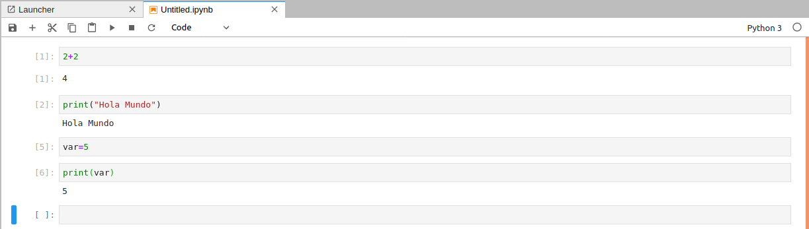

# Instalando Python

En esta lección aprenderemos a:

- Instalar un editor por defecto (Atom)
- Instalar Anaconda
- Instalar JupyterLab

## Instalar un editor por defecto (Atom)

1. Para instalar Atom, ejecutar los siguientes comandos:
```bash
# Add repository
$ wget -qO - https://packagecloud.io/AtomEditor/atom/gpgkey | sudo apt-key add -
$ sudo sh -c 'echo "deb [arch=amd64] https://packagecloud.io/AtomEditor/atom/any/ any main" > /etc/apt/sources.list.d/atom.list'
$ sudo apt-get update
# Install Atom
$ sudo apt-get install atom
```

# Instalar Anaconda

1. Descargar [Anaconda - Python 3.7](https://www.anaconda.com/distribution/).

chmod 777 Anaconda3-2020.02-Linux-x86_64.sh

2. Desde una terminal, instalar Anaconda ejecutando los siguientes comandos:

```bash
$ chmod 777 Anaconda3-2020.02-Linux-x86_64.sh
$ ./Anaconda3-2020.02-Linux-x86_64.sh
```
3. Aceptar todas las opciones por defecto.

4. Asegurarse responder `yes` cuando aparezca el siguiente mensaje:

```bash
Do you wish the installer to initialize Anaconda3
by running conda init? [yes|no]
```

5. Cerrar la Terminal y abrir una nueva. El prompt debe mostrar el prefijo `(base)`:
```bash
(base) axity@vm-training:~$
```

# Instalar JupyterLab

1. Para instalar JupyterLab, ejecutar el siguiente comando:

```bash
$ conda install -c conda-forge jupyterlab
```

2. Para iniciar JupyterLab, ejecutar el siguiente comando:

```bash
$ jupyter lab
```

# Un paseo rápido por JupyterLab La

Después de iniciar JupyterLab:

1. Ir a File->New->Notebook



2. Seleccionar Python



3. Ejecutar algunos comandos


