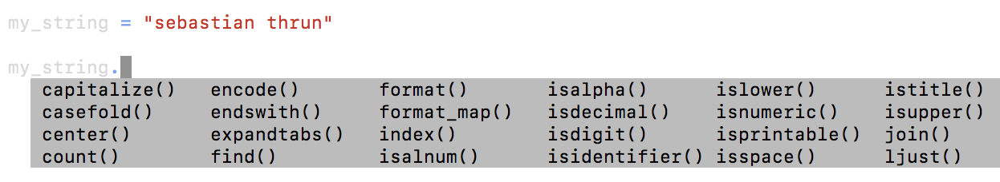

# Tipos de Datos y Operadores

En esta lección conoceremos aprenderemos acerca de:

- Operadores
	- Aritméticos
	- De Asignación
	- De Comparación
	- Lógicos

- Tipos de Datos: Integers, Floats, Booleans, Strings

- Conversión de tipos de datos

- Funciones incorporadas (Built-in)

- Guías de estilo (Best Practices)

## Operadores

### Aritméticos

-   `+` Suma
-   `-` Resta
-   `*` Multiplicación
-   `/` División
-   `%` Residuo (el remanente después de una división)
-   `**` Exponenciación
-   `//` Divide y redondea al entero más cercano

### Operadores de Asignación


> Use JupyterLab para probar los siguientes operadores

Para asignar un valor a una variable:

```py
x = 3
y = 4
z = 5
```

Lo anterior es igual a:

```py
x, y, z = 3, 4, 5
```

## Booleanos, Operadores de Comparación y Operadores Lógicos

### Operadores de Comparación

| Símbolo/Caso de Uso | Booleano | Operación |
|--|--|--|
| 5 < 3	| False	| Menor que 		|
| 5 > 3	| True	| Más grande que	|
| 3 <= 3| True	| Menor o igual a	|
| 3 >= 5| False	| Mayor o igual a	|
| 3 == 5| False	| Igual a 		|
| 3 != 5| True 	| No igual a 		|

### Operadores Lógicos

| Símbolo/Caso de Uso | Booleano | Operación |
|--|--|--|
| 5 < 3 `and` 5 == 5	| False	| `and` evalúa si todas las declaraciones son ciertas (True)|
| 5 < 3 `or` 5 == 5	| True	| `or` evalúa si alguna de las declaraciones es cierta (True)|
| `not` 5 < 3		| True	| `not` Invierte el valor del resultado|

###

## Tipos de Datos

### Enteros y Flotantes (Integer, Float)

-   **int** - para valores enteros
-   **float** - para valores decimales o de punto flotante

```py
x = int(4.7)   # x es ahora un entero = 4
y = float(4)   # y es ahora un valor de punto flotante = 4.0

```

Para checar el tipo de datos de un objeto podemos usar la función `type`:

```py
>>> print(type(4))
int
>>> print(type(3.7))
float
>>> print(type('this'))
str
>>> print(type(True))
bool
```

### Cadena (String)

Las cadenas en Python se muestran como el tipo variable `str`. Se puede definir una cadena con comillas dobles `"` o comillas simples `'`

> Si la cadena que está creando contiene uno de estos dos caracteres, se debe tener cuidado para asegurarse que el código no genere un error.

```py
>>> my_string = 'this is a string!'
>>> my_string2 = "this is also a string!!!"
```

Podemos incluir el caracter `\` en una cadena para incluir comillas simples como parte de la misma cadena:

```py
>>> this_string = 'Simon\'s skateboard is in the garage.'
>>> print(this_string)
```

```py
Simon's skateboard is in the garage.
```

**¿Qué pasa si en el ejemplo anterior no incluimos el caracter `\`?**

Para acceder una cadena:

```py
>>> first_word = 'Hello'
>>> second_word = 'There'
>>> print(first_word + second_word) # Concatenar dos cadenas
HelloThere

>>> print(first_word + ' ' + second_word)
Hello There

>>> print(first_word * 5)
HelloHelloHelloHelloHello

>>> print(len(first_word))
5
```

```py
>>> first_word[0]
H
>>> first_word[1]
e
```

Para obtener la longitud de una cadena podemos usar la función `len()`, la cual es una función incorporada (Built-in) de Python:

```py
print(len("ababa") / len("ab"))
2.5
```

### Boleanos

Para definir un tipo de dato booleano:

```py
x = True
y = False

print(type(x))
type(y)
```

## Conversión de datos

Para poder convertir un tipo de datos a otro podemos usar las siguientes funciones de conversión (cast):

```py
>>> print(str(14))
'14'

>>> print(int(4.7))
4

>>> print(float(5))
5.0

>>> print(bool(1))
True
```

## Funciones incorporadas (Built-in)

Algunos métodos de cadena que podemos usar:



Para conocer todos los métodos que podemos usar, véase la [documentación de Python](https://docs.python.org/3.7/library/stdtypes.html#string-methods).

### Un método importante

El método cadena `format()` es uno de los métodos más útiles y que estaremos usando en el transcurso de nuestro curso. Este método reemplaza o complementa partes de una cadena con los valores de otros objetos o variables Algunos ejemplos de cómo podemos usar este método:

```py
print("Mohammed has {} balloons".format(27))
```

```py
animal = "dog"
action = "bite"
print("Does your {} {}?".format(animal, action))
```

```py
maria_string = "Maria loves {} and {}"
print(maria_string.format("math", "statistics"))
```

### Otro método interesante

Otro método de cadena que puede ser muy útil es el método `split()`. Este método divide una cadena en palabras y lo devuelve como una lista. Veamos algunos ejemplos y usos:

```py
new_str = "The cow jumped over the moon."
new_str.split()
```
```py
['The', 'cow', 'jumped', 'over', 'the', 'moon.']
```


Especificando un separador:

```py
new_str.split(' ', 3)
```
```py
['The', 'cow', 'jumped', 'over the moon.']
```

Limitando el número de elementos de la lista

```py
new_str.split(None, 3)
```
```py
['The', 'cow', 'jumped', 'over the moon.']
```
