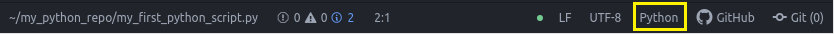

## Guías de estilo (Best Practices)

**[PEP8](https://www.python.org/dev/peps/pep-0008/)** es la guía oficial de estilo para Python y es importante mantenerla en mente si queremos ser parte de una comunidad de desarrollo o proyecto de desarrollo en Python.

Vea la siguiente documentación para conocer acerca de las mejores prácticas para escribir código en Python  [PEP8 Guidelines](https://www.python.org/dev/peps/pep-0008/).

Existen diversas herramientas que permiten evaluar el código de nuestros desarrollos en Python para determinar el nivel de apego a PEP8. Algunas de ellas:

- [Pycodestyle](https://pypi.org/project/pycodestyle/)
- [Pylint](https://www.pylint.org/)
- [pyflakes](https://pypi.org/project/pyflakes/)
- [Flake8](http://flake8.pycqa.org/en/latest/)
- [black](https://black.readthedocs.io/en/stable/)
- [autopep8](https://pypi.org/project/autopep8/)
- [Yet another Python formatter (yapf)](https://github.com/google/yapf)

Aunque para este curso usaremos **Atom** como editor de código, existen muchos otros. Algunos de ellos que podemos usar son:

- [Visual Studio Code](https://code.visualstudio.com/)
- [Atom](https://atom.io/)
- [Sublime Text](http://www.sublimetext.com/)
- [emacs](https://www.gnu.org/software/emacs/)
- [vim](http://www.vim.org/)
- [Notepad++](https://notepad-plus-plus.org/) (Solo Windows)

En Atom puede usar diferentes paquetes que utilizan las herramientas mencionadas previamente y que pueden ayudar a mantener los estándares de codificación de  **[PEP8](https://www.python.org/dev/peps/pep-0008/)**.

- [linter-pycodestyle](https://atom.io/packages/linter-pycodestyle)
- [linter-pylint](https://atom.io/packages/linter-pylint)
- [linter-python-pep8](https://atom.io/packages/linter-python-pep8) (reemplazado por `linter-pycodestyle`)

Seguir las mejores prácticas de codificación permite a otros programadores entender y leer su código de una forma más sencilla y legible

Lo importante es un código bien formateado para mejorar la legibilidad del código.

## Instalar herramientas para PEP8

Desde la **Terminal**, ejecute los siguientes comandos:

```bash
$ pip install pycodestyle
$ pip install pylint
```

## Configurar aspectos básicos en Atom

1. En Atom, ir a "Edit->Preferences".

2. Seleccionar la opción "Editor" que se encuentra en el panel izquierdo.

3. En el panel derecho, modificar las siguientes opciones:
	 - **Tab Length = 4**
	 - **Tab Type = soft**

5. Seleccionar la opción "Install" que se encuentra en el panel izquierdo.

## Configurar Atom para PEP8

5. En la barra de búsqueda ingresar `linter-pylint`.

6. Una vez que el paquete es encontrado seleccionar la opción "Install".

> [linter-pylint](https://atom.io/packages/linter-pylint) es un paquete que de forma similar a [linter-pycodestyle](https://atom.io/packages/linter-pycodestyle) nos genera recomendaciones o alertas sobre errores o temas de formato en el código basado en [PEP8](https://www.python.org/dev/peps/pep-0008/).

> Opcionalmente puede instalar el paquete [linter-pycodestyle](https://atom.io/packages/linter-pycodestyle) pero se recomienda tener habilitado solo uno de los paquetes para evitar que Atom genere múltiples mensajes (errores o advertencias) para cada uno de los paquetes instalados.

7. Por defecto Atom reconoce el tipo de script o programa que está abierto. Atom hace esto basado en la extensión del archivo. Sin embargo vale la pena asegurarse que en la **barra de estado** se tenga establecido el tipo de archivo correcto. Esto permite a Atom utilizar la paleta de colores estándar para identificar palabras reservadas, funciones, docstrings, comentarios, símbolos, operadores, etc.


